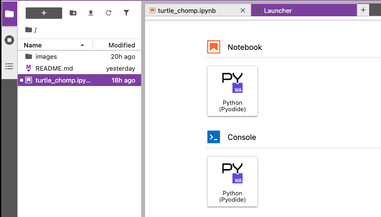

{}
Part of this chapter is based on tutorials by Geek Girls Carrots (https://github.com/ggcarrots/django-carrots).
{}

### Python prompt

Let's write some code!

We want to open up a Python console on our workshop. This console is a WebAssembly-powered Python kernel that is backed by Pyodide.



### Your first Python command!

You will notice that in this lesson, you use `>>>` before each command. For us this means that for now we may only use commands in the Python language. You don't have to type in `>>>` – Python will do that for you. Usually you would have to activate Python first in your own terminals after downloading it. However, it is already pre-installed and integrated for this workshop.


Let's start with something really simple. For example, try typing some math, like `2 + 3` and press the run button "▶︎" on the top left of the console.

<!-- command-line -->
```python {title="python"}
>>> 2 + 3
5
```

Nice! See how the answer popped out? Python knows math! You could try other commands like:

- `4 * 5`
- `5 - 1`
- `40 / 2`

To perform exponential calculation, say 2 to the power 3, we type:
<!-- command-line -->
```python {title="python"}
>>> 2 ** 3
8
```

Have fun with this for a little while and then get back here.

As you can see, Python is a great calculator. If you're wondering what else you can do…

### Strings

How about your name? Type your first name in quotes like this:

<!-- command-line -->
```python {title="python"}
>>> "Kate"
'Kate'
```

You've now created your first string! It's a sequence of characters that can be processed by a computer. The string must always begin and end with the same character. This may be single (`'`) or double (`"`) quotes (there is no difference!) The quotes tell Python that what's inside of them is a string.

Strings can be strung together. Try this:

<!-- command-line -->
```python {title="python"}
>>> "Hi there " + "Kate"
'Hi there Kate'
```

You can also multiply strings with a number:

<!-- command-line -->
```python {title="python"}
>>> "Kate" * 3
'KateKateKate'
```

If you need to put an apostrophe inside your string, you have two ways to do it.

Using double quotes:

<!-- command-line -->
```python {title="python"}
>>> "Runnin' down the hill"
"Runnin' down the hill"
```

or escaping the apostrophe with a backslash (`\`):

<!-- command-line -->
```python {title="python"}
>>> 'Runnin\' down the hill'
"Runnin' down the hill"
```

Nice, huh? To see your name in uppercase letters, try typing:

<!-- command-line -->
```python {title="python"}
>>> "Kate".upper()
'Kate'
```

You just used the `upper` __method__ on your string! A method (like `upper()`) is a sequence of instructions that Python has to perform on a given object (`"Kate"`) once you call it.

If you want to know the number of letters contained in your name, there is a __function__ for that too!

<!-- command-line -->
```python {title="python"}
>>> len("Kate")
4
```

Wonder why sometimes you call functions with a `.` at the end of a string (like `"Kate".upper()`) and sometimes you first call a function and place the string in parentheses? Well, in some cases, functions belong to objects, like `upper()`, which can only be performed on strings. In this case, we call the function a __method__. Other times, functions don't belong to anything specific and can be used on different types of objects, just like `len()`. That's why we're giving `"Kate"` as a parameter to the `len` function.

### Summary

OK, enough of strings. So far you've learned about:

- __the prompt__ – typing commands (code) into the Python prompt results in answers in Python
- __numbers and strings__ – in Python numbers are used for math and strings for text objects
- __operators__ – like `+` and `*`, combine values to produce a new one
- __functions__ – like `upper()` and `len()`, perform actions on objects.

These are the basics of every programming language you learn. Ready for something harder?

### Errors

Let's try something new. Can we get the length of a number the same way we could find out the length of our name? Type in `len(304023)` and hit `enter`:

<!-- command-line -->
```python {title="python"}
>>> len(304023)
Traceback (most recent call last):
  File "<stdin>", line 1, in <module>
TypeError: object of type 'int' has no len()
```

We got our first error! It says that objects of type "int" (integers, whole numbers) have no length. So what can we do now? Maybe we can write our number as a string? Strings have a length, right?

<!-- command-line -->
```python {title="python"}
>>> len(str(304023))
6
```

It worked! We used the `str` function inside of the `len` function. `str()` converts everything to strings.

- The `str` function converts things into __strings__
- The `int` function converts things into __integers__

> Important: we can convert numbers into text, but we can't necessarily convert text into numbers – what would `int('hello')` be anyway?

### Variables

An important concept in programming is variables. A variable is nothing more than a name for something so you can use it later. Programmers use these variables to store data, make their code more readable and so they don't have to keep remembering what things are.

Let's say we want to create a new variable called `name`:

<!-- command-line -->
```python {title="python"}
>>> name = "Kate"
```

As you've noticed, your program didn't return anything like it did before. So how do we know that the variable actually exists? Simply enter `name` and hit `enter`:

<!-- command-line -->
```python {title="python"}
>>> name
'Kate'
```

Yippee! Your first variable! You can always change what it refers to:

<!-- command-line -->
```python {title="python"}
>>> name = "Sonja"
>>> name
'Sonja'
```

You can use it in functions too:

<!-- command-line -->
```python {title="python"}
>>> len(name)
5
```

Awesome, right? Of course, variables can be anything – numbers too! Try this:

<!-- command-line -->
```python {title="python"}
>>> a = 4
>>> b = 6
>>> a * b
24
```

But what if we used the wrong name? Can you guess what would happen? Let's try!

<!-- command-line -->
```python {title="python"}
>>> city = "Tokyo"
>>> ctiy
Traceback (most recent call last):
  File "<stdin>", line 1, in <module>
NameError: name 'ctiy' is not defined
```

An error! As you can see, Python has different types of errors and this one is called a **NameError**. Python will give you this error if you try to use a variable that hasn't been defined yet. If you encounter this error later, check your code to see if you've mistyped any names.

Play with this for a while and see what you can do!

### The print function

Try this:

<!-- command-line -->
```python {title="python"}
>>> name = 'Maria'
>>> name
'Maria'
>>> print(name)
Maria
```

When you just type `name`, the Python interpreter responds with the string *representation* of the variable 'name', which is the letters M-a-r-i-a, surrounded by single quotes, ''. When you say `print(name)`, Python will "print" the contents of the variable to the screen, without the quotes, which is neater.

As we'll see later, `print()` is also useful when we want to print things from inside functions, or when we want to print things on multiple lines.

### Lists

Beside strings and integers, Python has all sorts of different types of objects. Now we're going to introduce one called __list__. Lists are exactly what you think they are: objects which are lists of other objects. :)

Go ahead and create a list:

<!-- command-line -->
```python {title="python"}
>>> []
[]
```

Yes, this list is empty. Not very useful, right? Let's create a list of lottery numbers. We don't want to repeat ourselves all the time, so we will put it in a variable, too:

<!-- command-line -->
```python {title="python"}
>>> lottery = [3, 42, 12, 19, 30, 59]
```

All right, we have a list! What can we do with it? Let's see how many lottery numbers there are in a list. Do you have any idea which function you should use for that?

<!-- command-line -->
```python {title="python"}
>>> len(lottery)
6
```

Yes! `len()` can give you a number of objects in a list. Handy, right? Maybe we will sort it now:

<!-- command-line -->
```python {title="python"}
>>> lottery.sort()
```

This doesn't return anything, it just changed the order in which the numbers appear in the list. Let's print it out again and see what happened:

<!-- command-line -->
```python {title="python"}
>>> print(lottery)
[3, 12, 19, 30, 42, 59]
```

As you can see, the numbers in your list are now sorted from the lowest to highest value. Congrats!

Maybe we want to reverse that order? Let's do that!

<!-- command-line -->
```python {title="python"}
>>> lottery.reverse()
>>> print(lottery)
[59, 42, 30, 19, 12, 3]
```

If you want to add something to your list, you can do this by typing this command:

<!-- command-line -->
```python {title="python"}
>>> lottery.append(199)
>>> print(lottery)
[59, 42, 30, 19, 12, 3, 199]
```

If you want to show only the first number, you can do this by using __indexes__. An index is the number that says where in a list an item occurs. Programmers prefer to start counting at 0, so the first object in your list is at index 0, the next one is at 1, and so on. Try this:

<!-- command-line -->
```python {title="python"}
>>> print(lottery[0])
59
>>> print(lottery[1])
42
```

As you can see, you can access different objects in your list by using the list's name and the object's index inside of square brackets.

To delete something from your list you will need to use __indexes__ as we learned above and the `pop()` method. Let's try an example and reinforce what we learned previously; we will be deleting the first number of our list.

<!-- command-line -->
```python {title="python"}
>>> print(lottery)
[59, 42, 30, 19, 12, 3, 199]
>>> print(lottery[0])
59
>>> lottery.pop(0)
59
>>> print(lottery)
[42, 30, 19, 12, 3, 199]
```

That worked like a charm!

For extra fun, try some other indexes: 6, 7, 1000, -1, -6 or -1000. See if you can predict the result before trying the command. Do the results make sense?

You can find a list of all available list methods in this chapter of the Python documentation: https://docs.python.org/3/tutorial/datastructures.html

{}
If you would like to listen to Ola explain Python basics: [Python Basics: Integers, Strings, Lists, Variables and Errors](https://www.youtube.com/watch?v=MO63L4s-20U) video.
{}

### Dictionaries

A dictionary is similar to a list, but you access values by looking up a key instead of a numeric index. A key can be any string or number. The syntax to define an empty dictionary is:

<!-- command-line -->
```python {title="python"}
>>> {}
{}
```

This shows that you just created an empty dictionary. Hurray!

Now, try writing the following command (try substituting your own information, too):

<!-- command-line -->
```python {title="python"}
>>> participant = {'name': 'Kate', 'country': 'Australia', 'favourite_numbers': [7, 12, 91]}
```

With this command, you just created a variable named `participant` with three key–value pairs:

- The key `name` points to the value `'Kate'` (a `string` object),
- `country` points to `'Australia'` (another `string`),
- and `favourite_numbers` points to `[7, 12, 91]` (a `list` with three numbers in it).

You can check the content of individual keys with this syntax:

<!-- command-line -->
```python {title="python"}
>>> print(participant['name'])
Kate
```

See, it's similar to a list. But you don't need to remember the index – just the name.

What happens if we ask Python the value of a key that doesn't exist? Can you guess? Let's try it and see!

<!-- command-line -->
```python {title="python"}
>>> participant['age']
Traceback (most recent call last):
  File "<stdin>", line 1, in <module>
KeyError: 'age'
```

Look, another error! This one is a **KeyError**. Python is helpful and tells you that the key `'age'` doesn't exist in this dictionary.

When should you use a dictionary or a list? Well, that's a good point to ponder. Just have a solution in mind before looking at the answer in the next line.

- Do you just need an ordered sequence of items? Go for a list.
- Do you need to associate values with keys, so you can look them up efficiently (by key) later on? Use a dictionary.

Dictionaries, like lists, are *mutable*, meaning that they can be changed after they are created. You can add new key–value pairs to a dictionary after it is created, like this:

<!-- command-line -->
```python {title="python"}
>>> participant['favourite_language'] = 'Python'
```

Like lists, using the `len()` method on the dictionaries returns the number of key–value pairs in the dictionary. Go ahead and type in this command:

<!-- command-line -->
```python {title="python"}
>>> len(participant)
4
```

I hope it makes sense up to now. :) Ready for some more fun with dictionaries? Read on for some amazing things.

You can use the `pop()` method to delete an item in the dictionary. Say, if you want to delete the entry corresponding to the key `'favourite_numbers'`, type in the following command:

<!-- command-line -->
```python {title="python"}
>>> participant.pop('favourite_numbers')
[7, 12, 91]
>>> participant
{'country': 'Australia', 'favourite_language': 'Python', 'name': 'Kate'}
```

As you can see from the output, the key–value pair corresponding to the `'favourite_numbers'` key has been deleted.

As well as this, you can also change a value associated with an already-created key in the dictionary. Type this:

<!-- command-line -->
```python {title="python"}
>>> participant['country'] = 'Germany'
>>> participant
{'country': 'Germany', 'favourite_language': 'Python', 'name': 'Kate'}
```

As you can see, the value of the key `'country'` has been altered from `'Australia'` to `'Germany'`. :) Exciting? Hurrah! You just learned another amazing thing.

{}

If you would like to listen to Ola explain Python dictionaries: [Python Basics: Dictionaries](https://www.youtube.com/watch?v=ZX1CVvZLE6c) video.

{}

#### Summary

Awesome! You know a lot about programming now. In this last part you learned about:

- __errors__ – you now know how to read and understand errors that show up if Python doesn't understand a command you've given it
- __variables__ – names for objects that allow you to code more easily and to make your code more readable
- __lists__ – lists of objects stored in a particular order
- __dictionaries__ – objects stored as key–value pairs

Excited for the next part? :)

### Compare things

A big part of programming involves comparing things. What's the easiest thing to compare? Numbers, of course. Let's see how that works:

<!-- command-line -->
```python {title="python"}
>>> 5 > 2
True
>>> 3 < 1
False
>>> 5 > 2 * 2
True
>>> 1 == 1
True
>>> 5 != 2
True
```

We gave Python some numbers to compare. As you can see, not only can Python compare numbers, but it can also compare method results. Nice, huh?

Do you wonder why we put two equal signs `==` next to each other to compare if numbers are equal? We use a single `=` for assigning values to variables. You always, __always__ need to put two of them – `==` – if you want to check if things are equal to each other. We can also state that things are unequal to each other. For that, we use the symbol `!=`, as shown in the example above.

Give Python two more tasks:

<!-- command-line -->
```python {title="python"}
>>> 6 >= 12 / 2
True
>>> 3 <= 2
False
```

`>` and `<` are easy, but what do `>=` and `<=` mean? Read them like this:

- x `>` y means: x is greater than y
- x `<` y means: x is less than y
- x `<=` y means: x is less than or equal to y
- x `>=` y means: x is greater than or equal to y

Awesome! Wanna do one more? Try this:

<!-- command-line -->
```python {title="python"}
>>> 6 > 2 and 2 < 3
True
>>> 3 > 2 and 2 < 1
False
>>> 3 > 2 or 2 < 1
True
```

You can give Python as many numbers to compare as you want, and it will give you an answer! Pretty smart, right?

- __and__ – if you use the `and` operator, both comparisons have to be True in order for the whole command to be True
- __or__ – if you use the `or` operator, only one of the comparisons has to be True in order for the whole command to be True

Have you heard of the expression "comparing apples to oranges"? Let's try the Python equivalent:

<!-- command-line -->
```python {title="python"}
>>> 1 > 'django'
Traceback (most recent call last):
  File "<stdin>", line 1, in <module>
TypeError: unorderable types: int() > str()
```

Here you see that just like in the expression, Python is not able to compare a number (`int`) and a string (`str`).
Instead, it shows a **TypeError** and tells us the two types can't be compared together.

{}

If you would like to listen to Ola explain Python comparisons: [Python Basics: Comparisons](https://www.youtube.com/watch?v=7bzxqIKYgf4) video.

{}

### Boolean

Incidentally, you just learned about a new type of object in Python. It's called __Boolean__,  and it is probably the easiest type there is.

There are only two Boolean objects:
- True
- False

But for Python to understand this, you need to always write it as 'True' (first letter uppercase, with the rest of the letters lowercased). __true, TRUE, and tRUE won't work – only True is correct.__ (The same applies to 'False' as well.)

Booleans can be variables, too! See here:

<!-- command-line -->
```python {title="python"}
>>> a = True
>>> a
True
```

You can also do it this way:

<!-- command-line -->
```python {title="python"}
>>> a = 2 > 5
>>> a
False
```

Practice and have fun with Booleans by trying to run the following commands:

- `True and True`
- `False and True`
- `True or 1 == 1`
- `1 != 2`

Congrats! Booleans are one of the coolest features in programming, and you just learned how to use them!


### Next steps
Obviously, you're a pretty seasoned Python developer now, so feel free to write some code that you've learned today.
You can now go on to the next part of this workshop, where you'll learn more about what Python can do. Using its different functions to make your very own game!