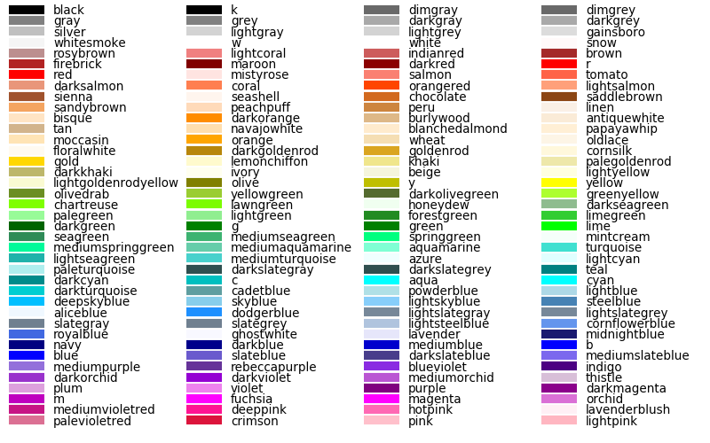

Colour is something that can easily change the tone and feel of your work. We can give our game some colour by assigning some to our canvas. There are lots to pick from including...



So we can add to our code the following...
```python {title = "python"}
canvas.fill_style = "blue" 
canvas.fill_rect(0, 0, WIDTH, HEIGHT)
```

[Google Colour Picker](https://share.google/AlzroUnU7TVllo0mj)